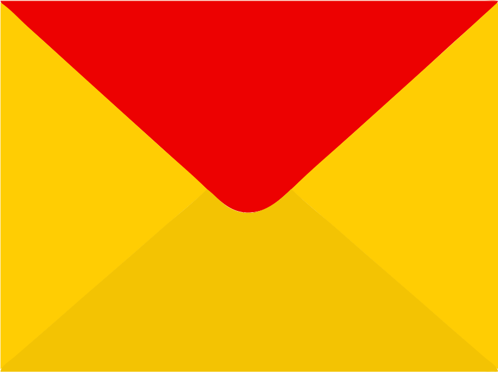

# Привет всем!👋

### Меня зовут Геннадий. Изучаю Python c 2022 года. Началось все с курсов на Stepike, далее изучал Аналитику данных в ГБОУ ДПО центр «Профессионал», после чего поступил на разработчика Python в у Яндекс.Практикум, обучение было сложным но интересным. В данный момент совершенствую свои знания в полученном материале и работаю над новыми проектами. Открыт для новых знакомств и предложений.

##### Стек технологий: 
Python, Django, DRF, Flask, REST API, PostgreSQL, Docker, Docker-compose, Yandex.Cloud, Bootstrap 4/5, HTML, CSS, git, js, pytest, unittest, venv, API, json, Linux, nginx, CI/CD, другие

## Стек и технологии:

  &nbsp;
  &nbsp;
  &nbsp;
  &nbsp;
  &nbsp;
  &nbsp;
  &nbsp;
  &nbsp;
  &nbsp;
  &nbsp;

## Контакты

